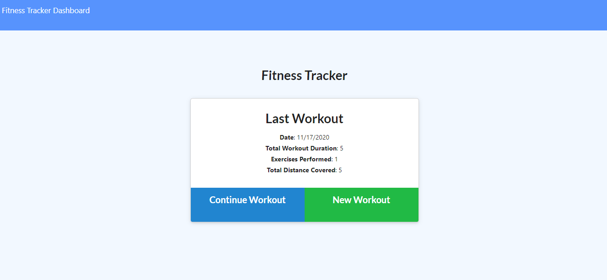

# homework_17_fitness_tracker
# 
For this assignment, you'll create a workout tracker.  This assignment is created in the Mongo database with a Mongoose schema and handle routes with Express.

## User Story

* As a user, I want to be able to view create and track daily workouts. I want to be able to log multiple exercises in a workout on a given day. I should also be able to track the name, type, weight, sets, reps, and duration of exercise. If the exercise is a cardio exercise, I should be able to track my distance traveled.

## Installation

To use application simply click on Heroku Link below

## Usage

Not Applicable 

## Technologies Used

NPM install: node server.js, nodemon server.js, node seeders/seed.js, express, logger, heroku, atlas db

## Problems I faced

API Routes were an issue 

## Credits

Ryan Witherspoon

## Image

## Links
[Link to GitHub!](https://github.com/ryanwit/homework_17_fitness_tracker)

[Link to Heroku!](https://ancient-chamber-43631.herokuapp.com/?id=5fb477371844ff00173df4af)

